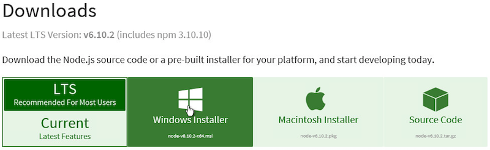
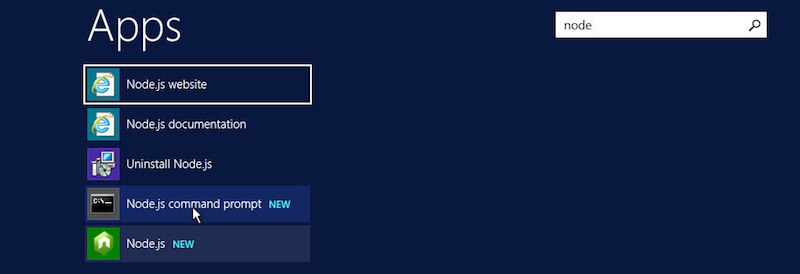
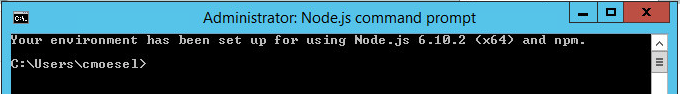

# CDS Connect CQL Execution Service on Windows Server 2012

Installing the CDS Connect CQL Execution Service on Windows Server 2012 requires the following steps, detailed below:

* Install Node.js 8.9.x
* Install Yarn
* Install CQL Execution Service
* Configure CQL Execution Service
* Install PM2
* Restart the CDS Connect CQL-ES Service
* Test

_**NOTE**: The current service operates on HTTP only.  This means that information between the client and the server is **not** encrypted.  Under this configuration, calls to the CQL Execution Service should originate from the same host and avoid going over the network._

# Install

## Install Node.js 8.9.x

The CQL Execution Service is a [Node.js](https://nodejs.org/) application, so it requires the Node.js runtime environment.

To install Node.js, first visit [https://nodejs.org/en/download/](https://nodejs.org/en/download/) and download the LTS Windows Installer (currently at v8.9.3).



Once the installer is downloaded, run the installer, always leaving the default options selected.

## Install Yarn

The CQL Execution Service uses a dependency management tool called [Yarn](https://yarnpkg.com/) to dynamically download dependency libraries.

To install the Yarn dependency management tool, visit [https://yarnpkg.com/lang/en/docs/install/](https://yarnpkg.com/lang/en/docs/install/), select the "Windows" tab, and click the "Download Installer" button.


Once the installer is downloaded, run the installer, always leaving the default options selected.

## Install CQL Execution Service

Installing the custom CQL Execution Service code requires extracting the cql-exec-service.zip file and performing a command to install its dependencies.  These steps are detailed below.

### Extract zip to C:\Pilot

The custom CQL Execution Service code is packaged in a cql-exec-service.zip file.  This file needs to be extracted into a new _C:\Pilot_ folder on the file system.

First, create the _C:\Pilot_ folder by opening the File Explorer, navigating to the _C:_ drive, selecting the _Home_ tab, and choosing "New folder".  Name the folder _Pilot_.


Then navigate to the cql-exec-service.zip file to extract it to _C:\Pilot_.


**Important**: Edit the location to be _C:\Pilot_ before clicking the _Extract_ button.

")

### Install the CQL Execution Service Dependencies

The CQL Execution Service dependencies are installed by running a Yarn command in the Node.js command prompt.  First, launch the "Node.js commmand prompt" application from the start menu.



The command prompt is essentially a specially configured DOS environment:



Then execute the commands:
```bat
> cd "C:\Pilot\cql-exec-service"
> yarn
```

If it is successful, you should see output similar to the following:
```
yarn install v0.22.0
[1/4] Resolving packages...
[2/4] Fetching packages...
[3/4] Linking dependencies...
[4/4] Building fresh packages...
Done in 61.25s.
```

## Configure CQL Execution Service

The CQL Execution Service requires a free Unified Medical Language System (UMLS) account from the National Library of Medicine (NLM).  If you do not yet have an account, [sign up here](https://uts.nlm.nih.gov//license.html).

Once you have an UMLS account, you will need to add your credentials to the CQL Execution Service configuration.  To do this, navigate to where you extracted the cql-exec-service.zip file (i.e., _C:\Pilot\cql-exec-service_).  Locate the _cql-es.config.js_ file, right-click it, and choose _edit_.


This will launch Notepad with the contents of the file.  Unfortunately, Notepad displays the whole file on a single line.  Scroll all the way to the right, and edit the values for _UMLS_USER_NAME_ and _UMLS_PASSWORD_ to be your actual UMLS username and password.


Ensure that you did _not_ remove the single quotes around your username and password (they are required to be there).  Once you're done, save the file and close Notepad.

## Install PM2

The CQL Execution Service uses [PM2](http://pm2.keymetrics.io/) as a process manager to ensure that the service runs on startup and recovers gracefully if the service crashes due to some unexpected issue.

### PM2 Program

PM2 can also be installed via the Node.js command prompt.  From the Node.js command prompt, execute the command:
```bat
> npm install pm2 -g
```

Some optional aspects of PM2 are not available on Windows.  As a result, you will likely see these two warnings (which are _expected_):
```
npm WARN optional SKIPPING OPTIONAL DEPENDENCY: fsevents@^1.0.0 (node_modules\pm2\node_modules\chokidar\node_modules\fsevents):
npm WARN notsup SKIPPING OPTIONAL DEPENDENCY: Unsupported platform for fsevents@1.1.1: wanted {"os":"darwin","arch":"any"} (current: {"os":"win32","arch":"x64"})
```

### PM2 Service

The PM2 Windows Service ensures that the application runs at startup and can be controlled via the Windows Service Manager.  To install the PM2 Windows Service, execute the following commands:
```bat
> mkdir "C:\Pilot\PM2"
> npm install pm2-windows-service -g
> pm2-service-install -n "CDS Connect CQL-ES"
```

The second command above will prompt you with several questions:

* ? Perform environment setup (recommended)? (Y/n) **Y**
* ? Set PM2_HOME? (Y/n)? **Y**
* ? PM2\_HOME value (this path should be accessible to the service user and should not contain any "user-context" variables \[e.g. %APPDATA%\]): () **C:\Pilot\PM2**
* ? Set PM2\_SERVICE\_SCRIPTS (the list of start-up scripts for pm2)? (Y/n) **Y**
* ? Set the list of startup scripts/files (semi-colon separated json config files or js files) () **C:\Pilot\cql-exec-service\cql-es.config.js**
* ? Set PM2\_SERVICE\_PM2\_DIR (the location of the global pm2 to use with the service)? \[recommended\] (Y/n) **Y**
* ? Specify the directory containing the pm2 version to be used by the service (C:\USERS\${Your\_Username}\APPDATA\ROAMING\NPM\node\_modules\pm2\index.js) **_\<hit enter key\>_**

After completing the setup, the service will be created.

# Restart the CDS Connect CQL-ES Service

Although the PM2 service installation indicates that the service has been started, this is often not actually the case.  To ensure the service is running, restart it from the Node.js command prompt:

```
> net stop "CDS Connect CQL-ES"
> net start "CDS Connect CQL-ES"
```

# Test

## The Home Page

If the service is running correctly, you should be able to load its home page in a browser by visiting: [http://localhost:3000](http://localhost:3000) (or replacing _localhost_ with the server name).


## The Test Client

From the Node.js command prompt, you can also execute a test client to ensure the API is working correctly.  This will post a message with synthetic data to the endpoint and show the response.

```bat
> node client post
```

If successful, you should see something like this:
```
--------------- START --------------
STATUS: 200 OK
--------------- HEADERS ------------
x-powered-by : Express
location : /api/library/USPSTF_Statin_Use_for_Primary_Prevention_of_CVD_in_Adults_FHIRv102/version/1.0.1
content-type : application/json; charset=utf-8
content-length : 769
etag : W/"301-S0M0zQt6oH2PdzaP5ph03w"
date : Wed, 20 Dec 2017 16:28:02 GMT
connection : close
--------------- BODY ---------------
{
  "library": {
    "name": "USPSTF_Statin_Use_for_Primary_Prevention_of_CVD_in_Adults_FHIRv102",
    "version": "1.0.1"
  },
  "returnExpressions": [
    "Recommendation",
    "Rationale",
    "Errors"
  ],
  "timestamp": "2017-12-20T16:28:02.029Z",
  "patientID": "2-1",
  "results": {
    "Recommendation": "Start low to moderate intensity lipid lowering therapy based on outcome of shared decision making between patient and provider",
    "Rationale": "The USPSTF found adequate evidence that use of low- to moderate-dose statins reduces the probability of CVD events (MI or ischemic stroke) and mortality by at least a moderate amount in adults aged 40 to 75 years who have 1 or more CVD risk factors (dyslipidemia, diabetes, hypertension, or smoking) and a calculated 10-year CVD event risk of 10% or greater.",
    "Errors": null
  }
}
--------------- DONE ---------------
```

### Test Client Arguments

By default, the test client posts synthetic records for an "unhealthy patient" to the USPSTF Statin Use endpoint.  These defaults can be overridden using commandline arguments.  For usage, run the command: `node client post --help`.

```bat
> node client post --help

  Usage: post|p [options]

  Post a JSON message to a library endpoint.  Options can be passed to
  specify the endpoint and message to post.  If not specified, the
  following defaults are used:
    --endpoint http://localhost:3000/api/library/USPSTF_Statin_Use_for_Primary_Prevention_of_CVD_in_Adults_FHIRv102/version/1.0.1
    --message test/examples/exec/unhealthy_patient.json

  Options:

    -h, --help            output usage information
    -e, --endpoint <url>  The endpoint to post the message to
    -m, --message <path>  The path containing the JSON message to post
```

As an example, you can try posting a different file as the message:

```bat
node client post -m test\examples\exec\healthy_patient.json
```

If successful, , you should see something like this (note the different _results_):
```
--------------- START --------------
STATUS: 200 OK
--------------- HEADERS ------------
x-powered-by : Express
location : /api/library/USPSTF_Statin_Use_for_Primary_Prevention_of_CVD_in_Adults_FHIRv102/version/1.0.1
content-type : application/json; charset=utf-8
content-length : 638
etag : W/"27e-UwHVEowAniejlYIKVKjVOQ"
date : Wed, 20 Dec 2017 16:43:50 GMT
connection : close
--------------- BODY ---------------
{
  "library": {
    "name": "USPSTF_Statin_Use_for_Primary_Prevention_of_CVD_in_Adults_FHIRv102",
    "version": "1.0.1"
  },
  "returnExpressions": [
    "Recommendation",
    "Rationale",
    "Errors"
  ],
  "timestamp": "2017-12-20T16:43:50.882Z",
  "patientID": "1-1",
  "results": {
    "Recommendation": "No USPSTF recommendation provided, as patient does not meet inclusion criteria",
    "Rationale": "The USPSTF guideline applies to adults aged 40 to 75 years who have 1 or more CVD risk factors (dyslipidemia, as evidenced by LDL > 130 mg/dL or HDL < 40 mg/dL, diabetes, hypertension, or smoking) and a calculated 10-year CVD event risk >= 7.5% (grade C) or >= 10% (grade B).",
    "Errors": null
  }
}
--------------- DONE ---------------
```