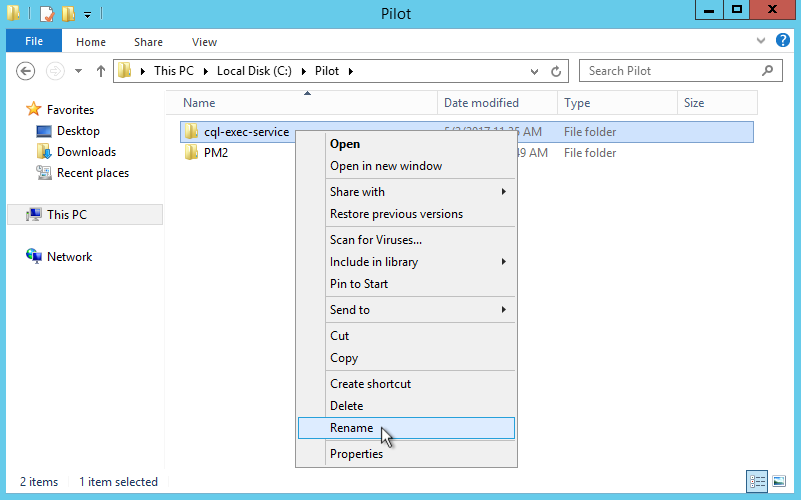
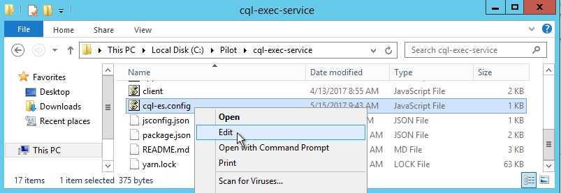
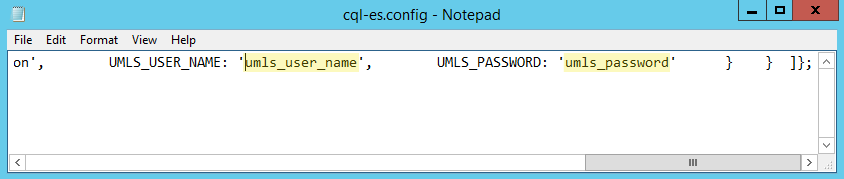
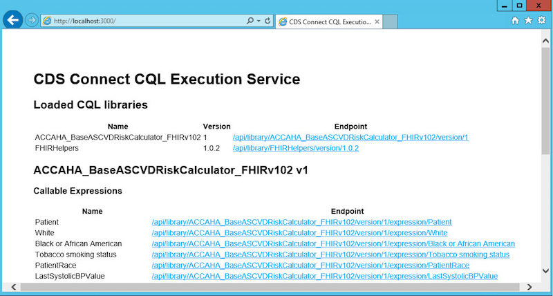

# Updating the CDS Connect CQL Execution Service on Windows Server 2012

These instructions assume you have already installed a previous version of the CQL execution service.  If not, please refer to the CDS Connect CQL Execution Service Installation instructions instead.

Updating the CDS Connect CQL Execution Service on Windows Server 2012 requires the following steps, detailed below:

* Stop the CDS Connect CQL-ES Service
* Rename the existing cql-execution-service folder
* Install the new CQL Execution Service
* Configure CQL Execution Service
* Start the CDS Connect CQL-ES Service
* Test

_**NOTE**: The current service operates on HTTP only.  This means that information between the client and the server is **not** encrypted.  Under this configuration, calls to the CQL Execution Service should originate from the same host and avoid going over the network._

# Cleanup Old Service

## Stop the CDS Connect CQL-ES Service

Before starting the update, stop the existing _CDS Connect CQL-ES_ service by executing the following command from the Node.js command prompt:

```
> net stop "CDS Connect CQL-ES"
```

## Rename the existing cql-execution-service folder

Rather than delete or overwrite the existing software, we will rename the folder in which it resides.  First, navigate to the _C:\Pilot_ folder (or wherever you installed the CQL Execution Service), then right-click the _cql-exec-service_ folder, and select _Rename_.

It's up to you what you rename it, but one suggestion is _cql-exec-service-v1_.



# Install New Service

## Install CQL Execution Service

After renaming the old service, you need to install the new service.  Installing the custom CQL Execution Service code requires extracting the cql-exec-service.zip file and performing a command to install its dependencies.  These steps are detailed below.

### Extract zip to C:\Pilot

The custom CQL Execution Service code is packaged in a cql-exec-service.zip file.  This file needs to be extracted into the _C:\Pilot_ folder on the file system.  Since the old installation was renamed, there should be no naming collash during the extraction.

Navigate to the cql-exec-service.zip file to extract it to _C:\Pilot_.


**Important**: Edit the location to be _C:\Pilot_ before clicking the _Extract_ button.

")

**Important**: Confirm that the new folder is in the same location as the previous version was.  This is important since this is where the existing _CDS Connect CQL-ES_ windows service will expect to find it.

### Install the CQL Execution Service Dependencies

The CQL Execution Service dependencies are installed by running a Yarn command in the Node.js command prompt.  Launch the "Node.js commmand prompt" application from the start menu, and then execute the commands:
```bat
> cd "C:\Pilot\cql-exec-service"
> yarn
```

If it is successful, you should see output similar to the following:
```
yarn install v0.22.0
[1/4] Resolving packages...
[2/4] Fetching packages...
[3/4] Linking dependencies...
[4/4] Building fresh packages...
Done in 61.25s.
```

## Configure CQL Execution Service

The CQL Execution Service requires a free Unified Medical Language System (UMLS) account from the National Library of Medicine (NLM).  If you do not yet have an account, [sign up here](https://uts.nlm.nih.gov//license.html).

Once you have an UMLS account, you will need to add your credentials the CQL Execution Service configuration.  To do this, navigate to where you extracted the cql-exec-service.zip file (i.e., _C:\Pilot\cql-exec-service_).  Locate the _cql-es.config.js_ file, right-click it, and choose _edit_.



This will launch Notepad with the contents of the file.  Unfortunately, Notepad displays the whole file on a single line.  Scroll all the way to the right, and edit the values for _UMLS_USER_NAME_ and _UMLS_PASSWORD_ to be your actual UMLS username and password.



Ensure that you did _not_ remove the single quotes around your username and password (they are required to be there).  Once you're done, save the file and close Notepad.

# Start the CDS Connect CQL-ES Service

Now that the new software has been installed and configured, start the CDS Connect CQL-ES service from the Node.js command prompt:

```
> net start "CDS Connect CQL-ES"
```

# Test

## The Home Page

If the service is running correctly, you should be able to load its home page in a browser by visiting: [http://localhost:3000](http://localhost:3000) (or replacing _localhost_ with the server name).



## The Test Client

From the Node.js command prompt, you can also execute a test client to ensure the API is working correctly.  This will post a message with synthetic data to the endpoint and show the response.

```bat
> node client post
```

If successful, you should see something like this:
```
--------------- START --------------
STATUS: 200 OK
--------------- HEADERS ------------
x-powered-by : Express
location : /api/library/ACCAHA_BaseASCVDRiskCalculator_FHIRv102/version/1/expression/PatientBaselineRisk
content-type : application/json; charset=utf-8
content-length : 197
etag : W/"c5-Sh2rTVJkZJjrb9nNplcOQQ"
date : Thu, 06 Apr 2017 15:02:11 GMT
connection : close
--------------- BODY ---------------
{
  "library": {
    "name": "ACCAHA_BaseASCVDRiskCalculator_FHIRv102",
    "version": "1"
  },
  "timestamp": "2017-04-06T15:02:11.043Z",
  "patientID": "2-1",
  "expression": "PatientBaselineRisk",
  "result": 0.32444153019908417
}
--------------- DONE ---------------
```

### Test Client Arguments

By default, the test client posts a synthetic records to the baseline risk endpoint, specifying that only the _PatientBaselineRisk_ expression should be returned.  These defaults can be overridden using commandline arguments.  For usage, run the command: `node client post --help`.

```bat
> node client post --help

  Usage: post|p [options]

  Post a JSON message to a library endpoint.  Options can be passed to
  specify the endpoint and message to post.  If not specified, the
  following defaults are used:
    --endpoint http://localhost:3000/api/library/ACCAHA_BaseASCVDRiskCalculator_FHIRv102/version/1/expression/PatientBaselineRisk
    --message test/fixtures/unhealthy_patient.json

  Options:

    -h, --help            output usage information
    -e, --endpoint <url>  The endpoint to post the message to
    -m, --message <path>  The path containing the JSON message to post
```

As an example, you can try posting a different file as the message:

```bat
node client post -m test\fixtures\healthy_patient.json
```

If successful, , you should see something like this (note the different _result_):
```
--------------- START --------------
STATUS: 200 OK
--------------- HEADERS ------------
x-powered-by : Express
location : /api/library/ACCAHA_BaseASCVDRiskCalculator_FHIRv102/version/1/expression/PatientBaselineRisk
content-type : application/json; charset=utf-8
content-length : 198
etag : W/"c6-0Vu3GQGwGdi1f089BqQ2WQ"
date : Thu, 06 Apr 2017 17:31:46 GMT
connection : close
--------------- BODY ---------------
{
  "library": {
    "name": "ACCAHA_BaseASCVDRiskCalculator_FHIRv102",
    "version": "1"
  },
  "timestamp": "2017-04-06T17:31:46.671Z",
  "patientID": "1-1",
  "expression": "PatientBaselineRisk",
  "result": 0.013991614443272016
}
--------------- DONE ---------------
```